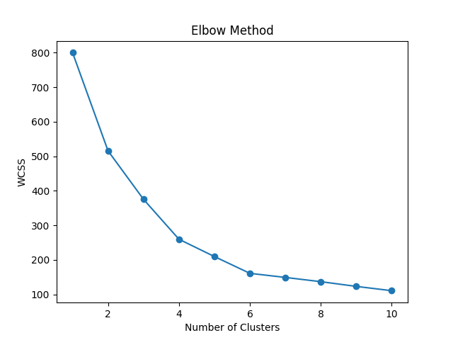

# 📊 K-Means Clustering Project

## 📌 Project Description
This project demonstrates the implementation of the **K-Means Clustering** algorithm using Python and scikit-learn.  
The goal is to group customers into different clusters based on their spending behavior and income using the Mall Customers dataset.

Clustering is an unsupervised machine learning technique used to discover hidden patterns in data.

---

## 🎯 Objective
The objective of this project is to:

- Apply K-Means clustering on a dataset  
- Determine optimal number of clusters using Elbow Method  
- Evaluate clustering using Silhouette Score  
- Visualize clusters using scatter plots  

---

## 🛠 Technologies & Libraries Used
- Python 3  
- Pandas  
- NumPy  
- Matplotlib  
- Seaborn  
- Scikit-learn  

---

## 📂 Project Structure
```
KMeans-Clustering/
│
├── kmeans.py
├── Mall_Customers.csv
├── Figure_1.png   (Elbow graph)
├── Figure_2.png   (Cluster graph)
└── README.md
```

---

## ▶️ How to Run the Program

### Step 1: Install required libraries
```bash
pip3 install pandas numpy matplotlib seaborn scikit-learn
```

### Step 2: Run the program
```bash
python3 kmeans.py
```

---

## 💻 Features
- Loads customer dataset  
- Selects numerical features  
- Normalizes data  
- Applies K-Means clustering  
- Uses Elbow Method to find optimal clusters  
- Calculates Silhouette Score  
- Visualizes clusters  

---

## 📊 Output
The program generates:

- Elbow Method graph  
- Cluster visualization graph  
- Silhouette Score in terminal  

### Elbow Method


### Cluster Visualization


---

## 🧠 Machine Learning Concepts Used
- K-Means Clustering  
- Unsupervised Learning  
- Elbow Method  
- Silhouette Score  
- Data Normalization  
- Cluster Visualization  

---

## 🎓 Learning Outcome
- How K-Means clustering works  
- How to choose optimal number of clusters  
- How to evaluate clustering quality  
- How to visualize clusters  
- How unsupervised learning is applied in real-world data  

